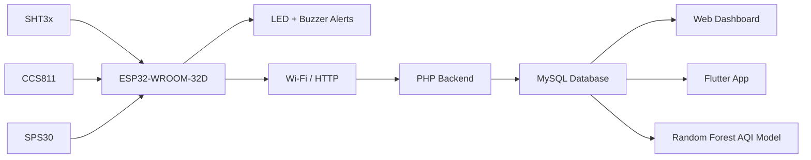

# Solar-Powered IoT Air Quality Monitoring System

**Computer Engineering Capstone: Ashesi University, 2025**  
**Isabel Prempeh Herraiz**

This project is a solar-powered air quality monitoring system built around an ESP32 and a custom PCB. It measures key environmental conditions, sends readings to a database, and displays the data through web and mobile interfaces. I also used a Random Forest model to explore AQI prediction from the sensor readings.

## What the system measures

- PM2.5 and PM10 using an SPS30 particulate-matter sensor
- eCO2 and TVOC using a CCS811 air-quality sensor
- Temperature and humidity using an SHT3x sensor

## How it works



The ESP32 reads the sensors and handles local alerts. Sensor data is sent over Wi-Fi to a PHP backend and stored in MySQL. The data can then be viewed through a browser dashboard or mobile interface.

## Hardware design

I designed the PCB in Fusion 360 around the ESP32-WROOM-32D. The board includes sensor connections, power regulation, battery charging, USB programming, status LEDs and a buzzer alert circuit.

The project also included a two-layer PCB layout and an outdoor casing for the assembled device.

## Firmware

The firmware in [`firmware/air_quality_monitor.ino`](firmware/air_quality_monitor.ino) covers:

- SHT31 temperature and humidity readings
- CCS811 eCO2 and TVOC readings
- SPS30 PM2.5 and PM10 readings
- air-quality threshold checks
- green/red status LEDs
- buzzer alerts

## Backend and dashboard

During development, I built a PHP/MySQL data flow for receiving readings from the ESP32 and displaying them in a browser.

```text
ESP32 → Wi-Fi/HTTP → PHP → MySQL → JSON → Dashboard
```

The backend example is in [`backend/prototype/`](backend/prototype/) and the dashboard example is in [`web-dashboard/prototype/`](web-dashboard/prototype/).

## Flutter app

The repository includes an early Flutter prototype in [`mobile-app/prototype/`](mobile-app/prototype/). It was used while testing the sensor-to-database-to-app flow.

The final capstone interface included live readings, historical views, charts and an AQI prediction screen.

## Machine learning

The notebook in [`machine-learning/`](machine-learning/) trains a Random Forest regressor using:

- PM2.5
- CO2
- VOCs
- temperature
- humidity

The capstone report records an 80/20 train-test split with:

- **MSE:** 35.67
- **R²:** 0.987

The training dataset is not included here because I want to verify the exact source version before publishing it.

## Testing

The completed system was tested as an outdoor prototype at Ashesi University. The project included:

- custom PCB assembly and continuity testing
- solar and battery power
- outdoor casing and deployment
- comparison with an AirQo reference device
- continuous stability testing

## Repository structure

```text
firmware/                ESP32 firmware
hardware/                schematic and ESP32 pin mapping
backend/prototype/       PHP/MySQL development backend
web-dashboard/prototype/ browser dashboard used during development
mobile-app/prototype/    early Flutter app prototype
machine-learning/        Random Forest notebook
```

## Project report

The full capstone report is available in [`IsabelPrempehCapstone_KofiAdu-Labi.pdf`](IsabelPrempehCapstone_KofiAdu-Labi.pdf). It includes the PCB schematic, routed board, app screens, testing images and implementation details.
