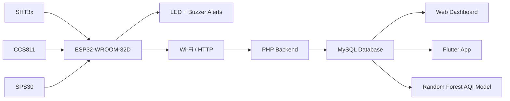

# Solar-Powered IoT Air Quality Monitoring System

**Computer Engineering Capstone: Ashesi University, 2025**  
**Isabel Prempeh Herraiz**

This project focused on building a solar-powered IoT system for monitoring air quality on campus. The system was built around an ESP32 and a custom PCB, with sensors for particulate matter, air quality, temperature and humidity.

The full project covered hardware design, embedded programming, data transmission, MySQL storage, web and mobile interfaces, and AQI prediction with a Random Forest model.

## What the system measures

- PM2.5 and PM10 using an SPS30 particulate-matter sensor
- eCO2 and TVOC using a CCS811 air-quality sensor
- temperature and humidity using an SHT3x sensor

## System overview



The ESP32 collected readings from the sensors and handled local status and alert functions. During development, sensor readings were also sent over Wi-Fi to a PHP/MySQL backend for storage and display.

## Hardware design

I designed a custom two-layer PCB in Fusion 360 around the ESP32-WROOM-32D. The design included:

- sensor connections
- power regulation
- battery charging
- USB programming
- status LEDs
- buzzer alert circuit

The final prototype was mounted in an outdoor casing and powered using a battery and solar panel.

## Firmware

The firmware included in [`firmware/air_quality_monitor.ino`](firmware/air_quality_monitor.ino) contains the sensor-reading and local alert part of the project.

It covers:

- SHT31 temperature and humidity readings
- CCS811 eCO2 and TVOC readings
- SPS30 PM2.5 and PM10 readings
- air-quality threshold checks
- green/red status LEDs
- buzzer alerts

## Backend and web dashboard

The development backend in [`backend/prototype/`](backend/prototype/) shows the ESP32-to-database data flow using PHP and MySQL.

```text
ESP32 → Wi-Fi/HTTP → PHP → MySQL → JSON → Dashboard
```

The browser dashboard in [`web-dashboard/prototype/`](web-dashboard/prototype/) displays recent readings and plots temperature and humidity using Chart.js.

## Flutter app

The Flutter source in [`mobile-app/prototype/`](mobile-app/prototype/) is an earlier development prototype used while testing the sensor-to-database-to-app flow.

The final capstone interface included live sensor readings, historical views, charts and an AQI prediction screen. Screenshots of that interface are included in the project report.

## Machine learning

The notebook in [`machine-learning/`](machine-learning/) uses a Random Forest regressor to predict AQI from:

- PM2.5
- CO2
- VOCs
- temperature
- humidity

The capstone report records an 80/20 train-test split with:

- **MSE:** 35.67
- **R²:** 0.987

The training dataset is not included in the public repository.

## Testing

The completed prototype was tested outdoors at Ashesi University. Testing included:

- PCB assembly and continuity checks
- solar and battery operation
- outdoor deployment
- comparison with an AirQo reference device
- continuous stability testing

## Repository structure

```text
firmware/                sensor and alert firmware
hardware/                hardware design notes
backend/prototype/       PHP/MySQL development backend
web-dashboard/prototype/ browser dashboard
mobile-app/prototype/    early Flutter development prototype
machine-learning/        Random Forest notebook
```

## Project report

The full capstone report is available in [`IsabelPrempehCapstone_KofiAdu-Labi.pdf`](IsabelPrempehCapstone_KofiAdu-Labi.pdf). It includes the PCB schematic, routed board, app screens, testing images and implementation details.
